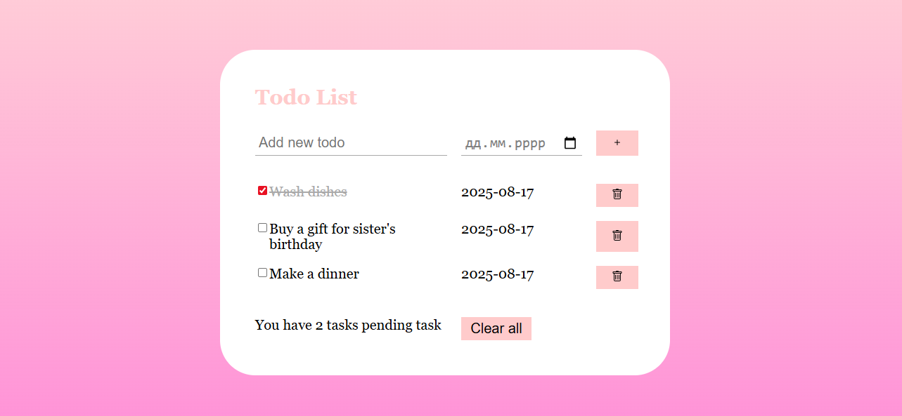

# Todo List App

A simple and efficient **Todo List web application** built using **HTML, CSS, and Vanilla JavaScript**.  
It allows users to add tasks, set due dates, delete tasks individually, and clear all tasks.  
Tasks are displayed in **descending order**, with the newest task appearing at the top.

---

## 🚀  Features

- **Add new tasks** with a name and optional due date.
- **Delete tasks** individually.
- **Clear all tasks** at once.
- **Persistent storage** – tasks are saved in `localStorage` even after a page refresh.
- **Tasks displayed in descending order** (latest tasks first).
- **Keyboard support** – Press **Enter** to add a task.
- **Task counter** showing the number of pending tasks.
- **Minimal and modern UI** with a gradient background.

---

## 🛠️ Technologies Used

- **HTML5** – Page structure
- **CSS3** – Styling & layout
- **Vanilla JavaScript (ES6)** – DOM manipulation & logic
- **LocalStorage** – Persistent data storage

## 🖼️ Screenshot

[**Live Demo**](https://varosya.github.io/todo-list/)
